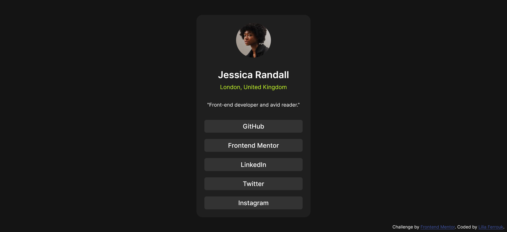
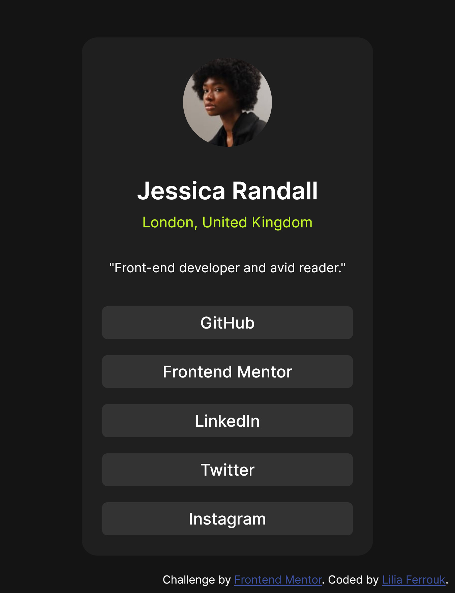

# Frontend Mentor - Social links profile solution

This is a solution to the [Social links profile challenge on Frontend Mentor](https://www.frontendmentor.io/challenges/social-links-profile-UG32l9m6dQ). Frontend Mentor challenges help you improve your coding skills by building realistic projects. 

## Table of contents

- [Overview](#overview)
  - [The challenge](#the-challenge)
  - [Screenshot](#screenshot)
  - [Links](#links)
- [My process](#my-process)
  - [Built with](#built-with)
  - [What I learned](#what-i-learned)

- [Author](#author)


## Overview

### The challenge

Users should be able to:

- See hover and focus states for all interactive elements on the page

### Screenshot

A screenshot of my solution from a desktop:


An other one from a mobile:



### Links

- Solution URL: [https://github.com/liliaferrouk/social-links-profile-main](https://github.com/liliaferrouk/social-links-profile-main)
- Live Site URL: [https://liliaferrouk.github.io/social-links-profile-main/](https://liliaferrouk.github.io/social-links-profile-main/)

## My process

### Built with

- HTML5
- CSS
- Mobile-first workflow


### What I learned

During this project, I acquired several valuable insights and skills:

- **Mobile-first Workflow:**
  - Embracing a mobile-first workflow proved more intriguing compared to a desktop-first approach. It reduces repetition because the starting point closely aligns with the mobile design, necessitating minimal styling adjustments.

- **box-sizing:**
  - Implementing box-sizing: border-box; proved transformative as it prevents elements from expanding when padding and margin are added, significantly enhancing layout control.

```css
*{
    margin: 0;
    box-sizing: border-box;
}
```

- **cursor:**
  - Employing cursor: pointer; for interactive elements enhanced user experience and navigation intuitiveness.


## Author

- - Frontend Mentor - [@liliaferrouk](https://www.frontendmentor.io/profile/liliaferrouk)